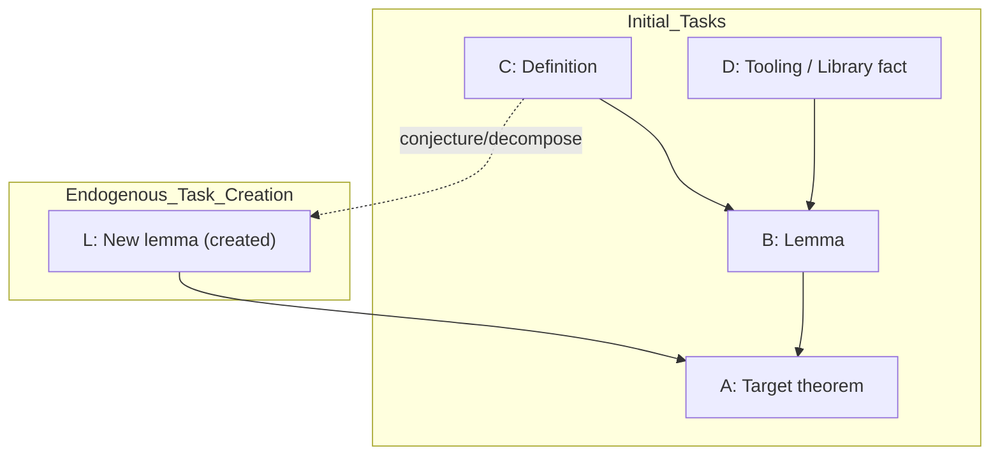

# Formalizing the Interdependent Task Allocation Problem

## Executive summary

This chapter draft formalizes the **Interdependent Task Allocation Problem (ITAP)** as a mathematical object suitable for (i) scheduling-theoretic analysis in a **centralized** regime and (ii) game-theoretic and learning-based analysis in a **decentralized** regime, matching the thesis framing in your Introduction and Table of Contents. fileciteturn0file1 fileciteturn0file0

At the modeling level, ITAP generalizes classical machine scheduling by adding four structural ingredients that are already implicit in your motivation: (a) tasks are linked by a **dependency relation** (a precedence DAG, possibly **evolving**), (b) agents are **heterogeneous** and may hold **private/uncertain** capability information, (c) tasks may be **preemptible** and progress may be stochastic (via processing-time distributions and/or success probabilities as a function of invested budget), and (d) agents may perform **endogenous task creation** (e.g., proposing intermediate lemmas) which modifies the task graph over time. fileciteturn0file1

The chapter then separates two coordination regimes: in the **centralized** regime, a planner chooses a joint allocation policy to optimize a system objective (e.g., makespan, weighted completion time, or expected welfare), thereby reducing special cases of ITAP to standard scheduling and assignment problems in the α|β|γ taxonomy. citeturn15search3 In the **decentralized** regime, autonomous agents choose actions strategically under partial observability; a market-mediated formulation (your thesis’s VAMP direction) can be sketched as a POSG augmented with verifiable settlement of contracts based on publicly checkable task completion. fileciteturn0file1

Finally, the chapter states canonical problem variants (decision and optimization), records complexity consequences inherited from the classical problems ITAP subsumes (NP-hardness and inapproximability for unrelated-machine makespan, NP-hardness under precedence constraints, hardness of equilibrium computation via PPAD/NEXP sources), and gives baseline LP relaxations and approximation-style heuristics that serve as both theoretical baselines and practical comparators for later learning-based chapters. citeturn13search8turn2search2turn14view0turn8search17turn8search12

## Formal model of ITAP

This section defines the primitives of ITAP “from first principles,” in a way that (i) reduces cleanly to classical scheduling when the graph is fixed and agents are obedient, and (ii) can be lifted to a decentralized stochastic game (and then to a market-mediated game) when agents are strategic.

### Notation and time model

Let \(N := \{1,\dots,n\}\) be the agent set. Time is either:

- **Discrete**: \(t \in \{0,1,\dots,H\}\) for horizon \(H \in \mathbb{N}\), convenient for POSG/MARL, or  
- **Continuous**: \(t \in [0,H]\), convenient for scheduling.

The remainder is written in discrete time for concreteness; continuous-time versions follow by standard limiting arguments (TODO: formalize the mapping you prefer for later chapters).

### Tasks, states, and verifiability

A **task** is an abstract object \(f\) with:

1. a **resolution state** \(x_t(f) \in \{\mathsf{unseen},\mathsf{available},\mathsf{in\_progress},\mathsf{resolved},\mathsf{failed}\}\),
2. a **verification relation** \(\mathsf{Verify}(f, c) \in \{0,1\}\) that checks a certificate \(c\) for task completion,
3. optional **reward/utility** parameters such as value \(w(f) \ge 0\), deadline \(d(f)\), release time \(r(f)\), etc.

The verifiability primitive is the key feature that later enables contract settlement in market mechanisms (a point that aligns with your Introduction’s emphasis on formal theorem proving). fileciteturn0file1

A minimal formalization is:

\[
\mathsf{Verify}: \mathcal{F} \times \mathcal{C} \to \{0,1\},
\]
where \(\mathcal{F}\) is the (possibly infinite) task universe and \(\mathcal{C}\) is a space of certificates.

**Assumption (soundness).** If \(\mathsf{Verify}(f,c)=1\) under the environment’s verification rules, then \(f\) is accepted as resolved and becomes publicly resolvable. (In theorem proving, this corresponds to kernel-checking; in other domains, it could be a unit test, formal spec check, or cryptographic proof.) (TODO: cite a theorem-prover kernel source if you decide to mention Lean’s kernel explicitly later.)

### Dependency graphs and feasibility

A **hard dependency structure** is a directed graph \(G_t = (V_t, E_t)\) on (currently known) tasks \(V_t \subseteq \mathcal{F}\). For \(g \to f \in E_t\), task \(f\) is not feasible to resolve until \(g\) is resolved and (depending on observability) made available to the relevant agent or to the public state.

Write \(\mathrm{Pred}_t(f) := \{g \in V_t : (g,f)\in E_t\}\).

A task \(f\) is **hard-feasible** at time \(t\) if all predecessors are resolved:
\[
\mathsf{Feasible}_t(f) \iff \forall g \in \mathrm{Pred}_t(f),\ x_t(g)=\mathsf{resolved}.
\]

This is the classical precedence constraint notion used throughout scheduling. citeturn2search2turn2search3

### Evolving graphs and endogenous task creation

To model discovery/decomposition (e.g., lemma creation), ITAP allows \(G_t\) to change over time.

A clean abstraction is to add a **task-generation operator** \(\mathsf{Gen}\) that, when invoked, returns a new task \(g\) and a set of edges \(E^{\mathrm{new}}\) that integrate it into the current graph:
\[
(g, E^{\mathrm{new}}) \sim \mathsf{Gen}(s_t, i, \text{anchor}, \tau),
\]
where \(s_t\) is the global state, \(i\) is the agent, “anchor” is a context task or goal, and \(\tau\) is invested budget. Then set:
\[
V_{t+1} := V_t \cup \{g\}, \quad E_{t+1} := E_t \cup E^{\mathrm{new}}.
\]

This is the basic mathematical device that distinguishes ITAP from fixed-instance scheduling: the job set is not exogenously given; it can be endogenously expanded. fileciteturn0file1

A useful restriction is to require acyclicity at every time:
\[
G_t \ \text{is a DAG for all } t.
\]
This matches precedence scheduling and avoids “unsatisfiable dependency” pathologies (TODO: decide whether you want to allow cycles to represent mutually dependent definitions and treat them via SCC condensation).

### Agent capabilities, uncertainty, and privacy

Each agent \(i \in N\) has a latent **type** \(\theta_i\) encoding its capability profile. ITAP supports three increasingly expressive capability models:

**Deterministic processing times.** Each (agent, task) pair has a processing time \(p_{i,f} \in \mathbb{R}_{\ge 0}\). This directly reduces to unrelated-machine scheduling when tasks are independent. citeturn0search5turn13search8

**Stochastic processing times.** Each pair \((i,f)\) has a distribution \(P_{i,f}\) over completion times. This connects to stochastic scheduling frameworks. (TODO: add a canonical stochastic scheduling citation if/when Chapter 3 uses one explicitly.)

**Budget-to-success models.** Especially natural when “attempts” have uncertain outcome (e.g., proof search): each pair has a success probability function
\[
\pi_{i,f}(\tau) := \Pr(\text{success on \(f\) after investing budget \(\tau\)}) \in [0,1],
\]
often assumed nondecreasing in \(\tau\) and exhibiting diminishing returns (concavity) as a modeling choice (TODO: justify or relax concavity depending on experiments).

**Privacy/observability.** In the centralized regime, the planner may observe \(\theta_i\) (or a proxy). In the decentralized regime, \(\theta_i\) is typically private, reflecting the classic informational barrier in truthful scheduling and mechanism design. citeturn1search2turn1search15

### Preemption and progress variables

For preemption, define a **progress state** \(y_t(i,f)\) that tracks how much of task \(f\) agent \(i\) has completed up to time \(t\). Two common models:

- **Preemptive-resume**: pausing does not waste work; progress accumulates additively.
- **Preemptive-restart**: pausing loses current partial progress (or incurs a restart cost).

In discrete time, if agent \(i\) allocates \(\tau\) units of budget to \(f\) at time \(t\), then:
\[
y_{t+1}(i,f) = y_t(i,f) + \tau
\]
(preemptive-resume), and the task resolves when \(y_t(i,f)\) crosses a threshold (deterministic) or triggers a success event with hazard determined by \(\pi_{i,f}\) (stochastic). Preemptive scheduling models and algorithms are classical and often admit different complexity/algorithmic behavior than nonpreemptive ones. citeturn12search7turn12search5

### Knowledge states and the “library” abstraction

For theorem proving (your motivating domain), it is natural to refine the global state into **public** and **private** libraries (or corpora), with monotone growth. Your current thesis outline already gestures at a library object \((C,RS,\delta,\Theta)\) and private/public inclusion invariants. fileciteturn0file1

A general-purpose abstraction consistent with that outline is:

- Public state \(L_t^0\) contains tasks that are publicly known and publicly verified as resolved (or at least publicly posted as claims).  
- Private state \(L_t^i\) contains agent \(i\)’s privately known tasks (including privately resolved but unpublished results).

A minimal invariant is:
\[
L_t^0 \subseteq L_t^i \quad \forall i, t,
\]
i.e., everyone knows the public library; individuals may know more. fileciteturn0file1

A theorem-proving-specific extension (optional, but matches your Chapter 2 outline) is:

- tasks are formulas/sequents in a logic \(\mathcal{F}\),
- there is an involution \(f \mapsto \neg f\) capturing negation, and one may impose consistency constraints between \(f\) and \(\neg f\). fileciteturn0file1

(TODO: decide how much of the logical structure belongs here vs. later chapters, since it may be VAMP-specific in your ToC.)

## Coordination regimes

This section formalizes the two coordination regimes as different “control layers” over the same primitives.

### Centralized regime

A **centralized ITAP instance** is one in which a planner chooses all agents’ actions at each time step.

Formally, let \(s_t\) denote the full system state: current known task set \(V_t\), dependency edges \(E_t\), resolution states \(x_t(\cdot)\), possibly agents’ private informational states (if revealed), and any progress variables \(y_t\). A **planner policy** is:
\[
\Pi: s_t \mapsto a_t = (a_t^1,\dots,a_t^n),
\]
where \(a_t^i\) specifies which action agent \(i\) executes (e.g., allocate budget \(\tau\) to a task \(f\), conjecture, publish, etc.).

The key assumption is **obedience**: agents follow assignments. This makes the model a (possibly stochastic/online) combinatorial optimization problem, with classical scheduling models obtained as special cases. citeturn15search3turn13search8

### Decentralized regime

A **decentralized ITAP instance** removes binding control: each agent chooses actions based on its own observations and utility.

Let \(o_t^i = \mathsf{Obs}_i(s_t)\) be the observation of agent \(i\). A decentralized policy is:
\[
\pi_i: (o_0^i,\dots,o_t^i) \mapsto a_t^i.
\]

This is naturally represented as a **partially observable stochastic game (POSG)**: state evolves stochastically under joint actions, agents have partial observations, and utilities may be misaligned. Your thesis’s later claim that decentralized planning/control is computationally hard even in cooperative settings is consistent with classic Dec-POMDP hardness results (NEXP-completeness for finite horizon). citeturn8search12

### Market-mediated VAMP sketch

Your thesis positions the decentralized regime as a **Verifiable Allocation Market POSG (VAMP)** in which agents trade claims on subtask completion and contracts settle against publicly verifiable events. fileciteturn0file1

A concise abstract interface that keeps Chapter 2 “first-principles” while setting up later chapters is:

- Introduce a transferable utility numéraire (credits/money) \(m_t^i\) for each agent.
- Define a contract space \(\mathcal{K}\) whose payoffs are functions of verifiable resolution events in the public library \(L^0\). For example, a simple bounty contract on task \(f\):
  \[
  k = (f, B) \quad \text{pays } B \text{ to the prover when } x(f)=\mathsf{resolved}.
  \]
- Specify a market mechanism \(\mathcal{M}\) that maps bids/offers and current market state to trades (bilateral contracts, posted prices, AMMs, LMSR-style markets, etc.). The prediction-market literature provides canonical convex cost-function market makers (including LMSR and general convex-cost frameworks) that are useful templates for “market as coordination layer.” citeturn4search1turn5search4turn9search9

The defining property that makes this feasible in ITAP (and particularly clean in theorem proving) is **public verifiability**: contracts settle based on mechanically checkable events, reducing disputes about completion. fileciteturn0file1

(TODO: in Chapter 5 you will likely give the formal VAMP tuple; here, keep \(\mathcal{M}\) as a black-box interface and defer settlement/collateral details.)

## Objectives and formal problem statements

This section provides (i) canonical objectives and (ii) decision/optimization problem statements.

### Canonical system objectives

Given a subset \(T \subseteq \mathcal{F}\) of **target tasks** (e.g., theorems-of-interest), define:

- **Makespan** (time to finish all targets):
  \[
  C_{\max}(T) := \max_{f\in T} C_f,
  \]
  where \(C_f\) is the completion time of task \(f\). This is the classical \(C_{\max}\) objective in scheduling. citeturn15search3turn13search8

- **Weighted completion time**:
  \[
  \sum_{f\in T} w_f \, C_f,
  \]
  where \(w_f\ge 0\) is importance/weight. This parallels standard \( \sum w_j C_j \) objectives. citeturn15search3turn15search7

- **Expected welfare / discounted utility** (stochastic and/or infinite-horizon):
  \[
  \max \ \mathbb{E}\!\left[\sum_{t=0}^{H} \gamma^t \left(\sum_{f \in \mathcal{F}} r_f \,\mathbf{1}\{x_t(f)=\mathsf{resolved}\} - \sum_{i\in N} c_i(a_t^i)\right)\right],
  \]
  where \(r_f\) is a reward for resolving \(f\), \(c_i\) is cost of effort/action, and \(\gamma\in(0,1]\) is a discount factor. (TODO: specify whether reward is paid once at completion or continuously while resolved.)

In decentralized settings, each agent has its own utility \(U_i\), and social welfare is typically \(\sum_i U_i\) (transferable utility case) or another aggregation; mechanism design concerns the gap between private incentives and welfare. citeturn3search0turn1search2

### Formal problems

To make complexity and reductions explicit, it helps to define a family of ITAP problems by toggling features. Let \(\mathsf{ITAP}[\cdot]\) denote a variant with specified assumptions.

**Problem (Static deterministic centralized ITAP, makespan).**  
Input:
- finite task set \(V\), dependency DAG \(G=(V,E)\),
- agents \(N\) with deterministic processing times \(p_{i,f}\),
- targets \(T\subseteq V\).

Output: assign each task \(f\) to an agent and schedule start times \(S_f\) satisfying:
1. precedence: \(S_f \ge C_g\) for all \(g\to f\),
2. machine capacity: each agent processes at most one task at a time,
3. completion: \(C_f = S_f + p_{i,f}\) if \(f\) assigned to \(i\),

to minimize \( \max_{f\in T} C_f\). This is precisely a precedence-constrained scheduling problem; in the α|β|γ notation this sits in the neighborhood of \(R|\mathrm{prec}|C_{\max}\) when \(p_{i,f}\) are arbitrary. citeturn15search3turn13search8turn2search2

**Decision version.** Given deadline \(D\), decide if there exists a schedule with \(C_{\max}(T)\le D\). NP-hardness follows from the special cases cited in the next section. citeturn13search8turn2search3

**Problem (Dynamic stochastic ITAP).**  
State includes evolving \(V_t,E_t\), and outcomes follow kernels for proof and conjecture actions. The output is a policy \(\Pi\) (centralized) or \((\pi_i)_{i\in N}\) (decentralized) maximizing expected discounted welfare. This is a stochastic control / POSG object; exact solution is intractable in general (Dec-POMDP NEXP-hardness is a baseline). citeturn8search12

### Mathematical programming formulations

Because later chapters will compare planners, markets, and learned policies, it is useful to present standard optimization relaxations now.

**Unrelated-machine makespan LP (LST LP).** For the special case with no precedence constraints and deterministic \(p_{i,f}\), the standard LP relaxation used by the Lenstra–Shmoys–Tardos 2-approximation is:

\[
\begin{aligned}
\min \ & T\\
\text{s.t. } 
&\sum_{i\in N} x_{i,f} = 1 \quad &&\forall f\in V,\\
&\sum_{f\in V} p_{i,f} \, x_{i,f} \le T \quad &&\forall i\in N,\\
&0 \le x_{i,f}\le 1 \quad &&\forall i,f.
\end{aligned}
\]

Rounding yields a schedule of length at most \(2T^\star\), giving the celebrated 2-approximation for \(R||C_{\max}\). citeturn0search5turn13search8

**Time-indexed LP for precedences (sketch).** For precedence constraints, one common approach is to time-index variables \(x_{i,f,t} \in [0,1]\) indicating “agent \(i\) processes task \(f\) at time \(t\)” and impose precedence through cumulative completion constraints. (TODO: choose a specific formulation and cite a standard reference; Chapter 3 may be the right place if you want to limit LP density here.)

## Complexity and relationship to classical models

This section records the main “inheritance” principle: because ITAP strictly generalizes well-studied scheduling and allocation problems, it inherits their hardness and approximation barriers. The statements are given with proof sketches/reductions appropriate for a Chapter 2 exposition; full proofs can be deferred or cited (as you prefer).

### Relationship to α|β|γ scheduling taxonomy

The α|β|γ notation (machine environment | constraints | objective) is standard in scheduling and appears in its canonical form in the classic survey by entity["people","Ronald L. Graham","scheduling theory"], entity["people","Eugene L. Lawler","scheduling theory"], entity["people","Jan Karel Lenstra","scheduling theory"], and entity["people","Alexander Rinnooy Kan","scheduling theory"]. citeturn15search3turn15search16

ITAP can be seen as a “superstructure” over this taxonomy:

- If \(E_t=\emptyset\), tasks are independent and ITAP collapses toward assignment/scheduling on parallel machines (P/Q/R models). citeturn15search3  
- If \(E_t\) is a fixed DAG, ITAP includes precedence-constrained scheduling. citeturn2search2turn14view0  
- If processing times are arbitrary \(p_{i,f}\), ITAP includes unrelated-machines scheduling \(R||C_{\max}\) as a special case. citeturn13search8turn0search5  
- If tasks are divisible in a continuous sense, the model moves toward divisible load theory; ITAP differs by making decomposition combinatorial and dependency-bearing. citeturn7search1  

### NP-hardness via scheduling special cases

**Proposition (centralized ITAP is NP-hard).** Even the static deterministic centralized ITAP with no endogenous task creation is NP-hard.

*Proof sketch.* Restrict ITAP to:
- no dependencies (\(E=\emptyset\)),
- one-shot nonpreemptive execution,
- deterministic processing times \(p_{i,f}\),
- objective minimize makespan.

This is exactly \(R||C_{\max}\), which is NP-hard; therefore the restricted ITAP variant is NP-hard, and so is the general ITAP. citeturn0search5turn13search8

**Proposition (identical-machines subcase is NP-hard).** The restriction to identical machines (all \(p_{i,f}=p_f\)) yields \(P||C_{\max}\), which is NP-hard (classic reduction from PARTITION). citeturn15search22

(TODO: if you want the reduction explicitly in Chapter 2, add a short PARTITION-to-two-machine-makespan reduction; ensure the exact statement matches your chosen scheduling variant.)

### Inapproximability inherited from unrelated machines

**Theorem (approximation barrier inherited from \(R||C_{\max}\)).** Unless \(P=NP\), no polynomial-time algorithm can approximate the unrelated-machines makespan problem within factor \(p<3/2\). citeturn13search8

Because \(R||C_{\max}\) is a special case of ITAP (as above), the same inapproximability applies to ITAP variants that include \(R||C_{\max}\) as a subproblem.

**Corollary (2-approx baseline).** The Lenstra–entity["people","David B. Shmoys","approximation algorithms"]–entity["people","Eva Tardos","approximation algorithms"] rounding framework yields a polynomial-time 2-approximation for \(R||C_{\max}\), providing a natural “best-known general baseline” for that subcase of ITAP. citeturn0search5turn13search8

### Precedence constraints: tractability in special cases, hardness in general

Many ITAP instances feature precedence constraints. The classical landscape is:

- For special precedence structures (e.g., in-trees and unit processing times), polynomial-time optimal algorithms exist; a canonical result is entity["people","T. C. Hu","operations research"]’s algorithm for tree precedences. citeturn2search1  
- For two processors and unit execution times, the entity["people","Edward G. Coffman Jr.","scheduling theory"]–Graham algorithm yields optimal schedules (or near-optimal variants depending on the exact model). citeturn1search1turn1search17  
- For general precedence constraints, complexity rises sharply; the complexity and NP-completeness landscape is developed in classic works on precedence-constrained scheduling. citeturn2search2turn2search3  

**Theorem (list scheduling baseline and “2 barrier”).** entity["people","Ola Svensson","approximation algorithms"]’s SIAM J. Computing paper highlights that Graham’s list scheduling yields a 2-approximation for scheduling precedence constrained jobs on identical machines to minimize makespan, and that improving upon this factor is a major open problem (with conditional hardness connections). citeturn14view0

This matters for ITAP because “dependency-aware allocation” can subsume precisely that precedence scheduling setting, so the same barrier appears for broad ITAP classes.

### Mechanism-design hardness for eliciting capabilities

The centralized regime implicitly assumes the planner knows or can obtain agent capabilities. In strategic settings, that assumption is nontrivial.

The seminal “truthful scheduling” program initiated by entity["people","Noam Nisan","algorithmic mechanism design"] and entity["people","Amir Ronen","algorithmic mechanism design"] studies makespan minimization on unrelated machines when machines are strategic and processing times are private. citeturn1search2

A recent breakthrough by entity["people","George Christodoulou","algorithmic game theory"], entity["people","Elias Koutsoupias","algorithmic game theory"], and entity["people","Annamaria Kovacs","algorithmic game theory"] proves the Nisan–Ronen conjecture: deterministic truthful mechanisms cannot approximate the optimal makespan better than factor \(n\) for \(n\) unrelated machines. citeturn1search15turn1search26

This directly supports the thesis narrative that “even if one wants to centralize,” eliciting capabilities truthfully with good approximation guarantees may be impossible in general, motivating decentralized or market-mediated approaches. citeturn1search15turn1search2

### Decentralized regime: equilibrium and decentralized control hardness

If ITAP is cast as a decentralized POSG (or a market-augmented POSG), two foundational hardness sources become relevant:

- **Decentralized planning/control hardness**: finite-horizon Dec-POMDPs are NEXP-complete in general, even for cooperative agents, establishing a baseline intractability for exact decentralized optimization. citeturn8search12  
- **Equilibrium computation hardness**: computing Nash equilibria is PPAD-complete in broad settings; PPAD was introduced by entity["people","Christos Papadimitriou","theoretical computer science"], and PPAD-completeness of Nash equilibrium computation is shown in classic works by entity["people","Constantinos Daskalakis","algorithmic game theory"], entity["people","Paul W. Goldberg","algorithmic game theory"], and Papadimitriou (and, for two-player Nash, by entity["people","Xi Chen","theoretical computer science"] and entity["people","Xiaotie Deng","theoretical computer science"]). citeturn8search17turn8search18turn8search11  

A market-mediated VAMP can inherit both difficulty sources: strategic equilibrium reasoning (PPAD) and partial-observation multiagent control (NEXP). fileciteturn0file1 citeturn8search12turn8search17  
(TODO: write your VAMP-specific reduction cleanly once Chapter 5’s formal tuple is fixed; here it is enough to cite the two parent hardness mechanisms.)

## Baseline algorithms and relaxations

This section lists baseline methods that are canonically tied to the ITAP substructures and that serve as (i) theoretical anchors and (ii) practical baselines for later experiments.

### LP relaxations and assignment-based baselines

For the independent-task, unrelated-machine makespan subcase, the LST LP and rounding provide a principled 2-approximation baseline. citeturn0search5turn13search8 This is a natural “planner baseline” for the centralized regime when you freeze a snapshot of the task pool.

For generalized assignment-style objectives (cost + capacity), the classic LP-rounding approach of entity["people","David B. Shmoys","approximation algorithms"] and entity["people","Eva Tardos","approximation algorithms"] for the generalized assignment problem (GAP) is an important backbone relaxation, and it is directly relevant whenever a frozen ITAP state is treated as a capacitated allocation subproblem. citeturn0search2  
(TODO: if you reuse Shmoys–Tardos rounding later, make explicit whether you are rounding assignments, time slices, or contracts.)

### List scheduling and priority rules under precedence

For precedence-constrained scheduling on identical machines, classic list scheduling is the baseline and yields the longstanding factor-2 barrier discussed above. citeturn14view0turn15search0

Two ITAP-native priority indices that specialize to known scheduling heuristics are:

1. **Critical-path priority**: prioritize tasks with large downstream “distance-to-target” (a graph-theoretic proxy for future constraints). (TODO: cite a critical-path scheduling reference if you formalize it; otherwise treat as standard heuristic.)
2. **Height/level priority (HLF)**: prioritize tasks with largest level (distance from sources). This is closely related to precedence scheduling heuristics and appears in multiple scheduling contexts. citeturn12search18turn15search0

### Preemption-aware baselines

Allowing preemption can change both algorithm design and (sometimes) tractability. Classical work studies preemptive scheduling with precedence constraints on parallel machines and develops polynomial-time algorithms for certain cases. citeturn12search7turn12search5  

For ITAP, preemption-aware baselines include:

- **resume-allowed list scheduling**: permit pausing and resuming to reduce idle time caused by precedence bottlenecks (TODO: analyze in your specific discrete-time simulator model).  
- **restart-penalty heuristics**: penalize switching tasks to avoid wasted partial work (important when “proof attempts” have setup costs).

### Online and dynamic-task baselines

Endogenous task creation makes ITAP an online/dynamic instance selection problem: the available job set changes based on prior actions. A natural baseline is to treat task creation as “arrivals” and use online load-balancing/scheduling heuristics.

For online load balancing and machine scheduling, a representative classical reference is the work of entity["people","James Aspnes","theoretical computer science"], entity["people","Yossi Azar","theoretical computer science"], entity["people","Amos Fiat","theoretical computer science"], entity["people","Serge Plotkin","theoretical computer science"], and entity["people","Orli Waarts","theoretical computer science"], which treats online load balancing in a way that interfaces naturally with machine scheduling. citeturn10search23

In ITAP terms, a baseline “online planner” is:

- maintain a current pool of feasible tasks \(\{f:\mathsf{Feasible}_t(f)\}\),
- greedily assign each free agent \(i\) to a task \(f\) minimizing estimated \(p_{i,f}\) (or maximizing estimated marginal value per expected time),
- periodically re-evaluate when new subtasks are generated.

(TODO: supply a concrete adversarial and/or stochastic model of task creation if you want competitive-ratio-style statements.)

## Variants and illustrative examples

This section supplies the requested (i) small dependency-graph examples and (ii) a comparison table of ITAP variants and classical models.

### Illustrative dependency graph and endogenous creation

Below is a minimal example showing (a) hard dependencies and (b) endogenous task creation that introduces a new lemma node that becomes a prerequisite for a target.



A LaTeX-ready figure placeholder that you can later replace with a rendered version (or a nicer TikZ diagram) is:

```latex
\begin{figure}[t]
  \centering
  \fbox{\parbox[c][2.2in][c]{0.92\textwidth}{
    \centering
    \textbf{Placeholder: ITAP dependency graph example}\\
    (Include initial DAG + endogenous lemma creation)
  }}
  \caption{A small ITAP instance. Solid edges are hard dependencies. The dotted arrow indicates endogenous task creation (a new subtask/lemma is generated and then becomes a prerequisite for a target).}
  \label{fig:itap-small-example}
\end{figure}
```

### Counterexample intuition for myopic greedy allocation

A central phenomenon in ITAP (and in theorem-proving-like task graphs) is that myopic value-per-time greedy rules can be arbitrarily bad when tasks unlock high-value downstream nodes.

A minimal stylized construction is:

- Two agents \(i=1,2\).  
- A high-value target \(A\) requires prerequisite \(B\).  
- There exists an “easy but low-value” leaf task \(E\) that can consume one agent’s time.  
- If both agents greedily chase immediate reward, they may duplicate effort or starve \(B\), delaying \(A\).

This mirrors classical scheduling pathologies under precedence constraints, where choosing the “wrong” available job can increase makespan by forcing idle time on critical chains. citeturn14view0turn2search2  
(TODO: decide whether you want an explicit numeric instance here or reserve it for your experimental-baselines chapter.)

### Model-comparison table

The following LaTeX table compares ITAP variants to canonical related models. (Citations for the categories appear after the table.)

```latex
\begin{table}[t]
\centering
\small
\begin{tabular}{lccccccc}
\hline
Model & Heterog. & Precedence & Preempt. & Stochastic & Evolving tasks & Strategic agents & Verifiable \\
\hline
$P||C_{\max}$ & no & no & opt. & no & no & no & not assumed \\
$Q||C_{\max}$ & speeds & no & opt. & no & no & no & not assumed \\
$R||C_{\max}$ & yes & no & opt. & no & no & no & not assumed \\
$P|\mathrm{prec}|C_{\max}$ & no & yes & opt. & no & no & no & not assumed \\
GAP / assignment & yes & no & n/a & no & no & no & not assumed \\
Divisible Load Theory & yes & implicit & yes & sometimes & usually fixed & no & not assumed \\
MRTA (market-based) & yes & sometimes & sometimes & often & often & sometimes & domain-dependent \\
\hline
ITAP (centralized) & yes & yes & yes & yes & yes & no (obedient) & optional \\
ITAP (decentralized) & yes & yes & yes & yes & yes & yes & optional \\
VAMP-style ITAP & yes & yes & yes & yes & yes & yes & \textbf{yes} \\
\hline
\end{tabular}
\caption{Comparison of ITAP variants with classical and neighboring models.}
\label{tab:itap-model-comparison}
\end{table}
```

Connections for the rows are classical: P/Q/R and α|β|γ notation originate in the scheduling literature; the unrelated-machines makespan baseline and inapproximability are due to Lenstra–Shmoys–Tardos; precedence scheduling includes Hu and Coffman–Graham special cases; GAP has a canonical LP-rounding algorithm; divisible load theory is its own paradigm; MRTA and market-based coordination are standard in robotics and distributed AI. citeturn15search3turn13search8turn2search1turn1search1turn0search2turn7search1turn6search1turn6search6

## Bibliography, open problems, and connections

This final section delivers (i) a prioritized bibliography (primary sources first), (ii) a concise open-problems list, and (iii) a map from this chapter to later chapters in your thesis.

### Prioritized bibliography

The list below is prioritized by “most central to cite for Chapter 2 definitions + hardness + baselines,” then “central to your decentralized/market framing,” then “neighboring modern literature.”

**Scheduling taxonomy, precedence scheduling, and approximation baselines (primary/seminal).**  
- Graham–Lawler–Lenstra–Rinnooy Kan, “Optimization and approximation in deterministic sequencing and scheduling: a survey” (α|β|γ notation). citeturn15search3  
- Lenstra–Shmoys–Tardos, “Approximation algorithms for scheduling unrelated parallel machines” (2-approx and \(<3/2\) hardness claim). citeturn0search5turn13search8  
- Hu, “Parallel Sequencing and Assembly Line Problems” (tree precedence optimal algorithm). citeturn2search1  
- Coffman & Graham, “Optimal scheduling for two-processor systems” (two-processor precedence scheduling). citeturn1search1turn1search17  
- Lenstra & Rinnooy Kan, “Complexity of scheduling under precedence constraints” and Ullman, “NP-complete scheduling problems” (precedence complexity foundations). citeturn2search2turn2search3  
- Svensson, “Hardness of Precedence Constrained Scheduling on Identical Machines” (the 2-approx “barrier” discussion and conditional hardness connections). citeturn14view0  
- Shmoys & Tardos, “An approximation algorithm for the generalized assignment problem” (GAP LP rounding baseline). citeturn0search2  

**Mechanism design and truthful scheduling (primary/seminal + recent breakthrough).**  
- Vickrey (1961), Clarke (1971), Groves (1973) (VCG foundations). citeturn3search1turn3search2turn3search3  
- Myerson & Satterthwaite (1983) (bilateral trade impossibility). citeturn3search0  
- Nisan & Ronen, “Algorithmic Mechanism Design” (truthful scheduling as a canonical challenge). citeturn1search2  
- Christodoulou–Koutsoupias–Kovacs, “A Proof of the Nisan–Ronen Conjecture” (JACM, 2023). citeturn1search15turn1search26  

**Prediction markets, market makers, and no-regret connections (primary/seminal).**  
- Gneiting & Raftery (2007) (strictly proper scoring rules). citeturn4search0  
- Hanson (LMSR / market scoring rules). citeturn4search1turn4search7  
- Chen et al. (2008) (complexity of combinatorial market makers). citeturn4search8  
- Chen & Vaughan (2010) (prediction markets and no-regret learning duality). citeturn5search0turn5search5  
- Abernethy–Chen–Vaughan (2013) and Agrawal et al. (2011) (convex cost-function market maker frameworks). citeturn5search4turn9search9  
- Angeris & Chitra (2020) and Angeris et al. (2021/2022) (CFMM theory as a modern AMM template, if you use AMM analogies). citeturn9search0turn9search5  

**Distributed/robotic task allocation and market-based coordination (seminal + surveys).**  
- Smith (1980) (Contract Net Protocol). citeturn6search0  
- Gerkey & Matarić (2004) (MRTA taxonomy and formal analysis). citeturn6search1  
- Dias et al. (market-based multirobot coordination survey) and Zlot–Stentz (task abstraction/task-tree markets). citeturn6search6turn6search15  
- Bharadwaj–Ghose–Robertazzi (2003) + Bharadwaj et al. (1996 book) (divisible load theory). citeturn7search1turn7search6  
- Recent MRTA market-methods survey updates (optional, for “state of the art” framing). citeturn11search1turn11search5  

**Hardness foundations for decentralized regimes (primary/seminal).**  
- Bernstein–Zilberstein–Immerman (Dec-POMDP / decentralized control complexity). citeturn8search12  
- Papadimitriou (PPAD) and PPAD-completeness of Nash equilibrium computation (Daskalakis–Goldberg–Papadimitriou; Chen–Deng). citeturn8search17turn8search18turn8search11  

### BibTeX placeholders

Below is a compact BibTeX starter block. (Where you have exact venue/volume/page details, keep them; otherwise keep TODO placeholders; do not treat years as final if you later switch editions.)

```bibtex
@article{GLLR79,
  title        = {Optimization and approximation in deterministic sequencing and scheduling: a survey},
  author       = {Graham, Ronald L. and Lawler, Eugene L. and Lenstra, Jan Karel and Rinnooy Kan, Alexander H.G.},
  journal      = {Annals of Discrete Mathematics},
  year         = {1979},
  note         = {TODO: volume/pages/doi}
}

@article{LST90,
  title        = {Approximation algorithms for scheduling unrelated parallel machines},
  author       = {Lenstra, Jan Karel and Shmoys, David B. and Tardos, Eva},
  journal      = {Mathematical Programming},
  year         = {1990},
  note         = {TODO: volume/pages/doi}
}

@article{Hu61,
  title        = {Parallel Sequencing and Assembly Line Problems},
  author       = {Hu, T. C.},
  journal      = {Operations Research},
  year         = {1961},
  note         = {TODO: volume/pages/doi}
}

@article{CoffmanGraham72,
  title        = {Optimal scheduling for two-processor systems},
  author       = {Coffman, Edward G. and Graham, Ronald L.},
  journal      = {Acta Informatica},
  year         = {1972},
  note         = {TODO: volume/pages/doi}
}

@article{LenstraKan78,
  title        = {Complexity of scheduling under precedence constraints},
  author       = {Lenstra, Jan Karel and Rinnooy Kan, Alexander H. G.},
  journal      = {Operations Research},
  year         = {1978},
  note         = {TODO: volume/pages/doi}
}

@article{Ullman75,
  title        = {NP-complete scheduling problems},
  author       = {Ullman, Jeffrey D.},
  journal      = {Journal of Computer and System Sciences},
  year         = {1975},
  note         = {TODO: volume/pages/doi}
}

@article{ShmoysTardos93,
  title        = {An approximation algorithm for the generalized assignment problem},
  author       = {Shmoys, David B. and Tardos, Eva},
  journal      = {Mathematical Programming},
  year         = {1993},
  note         = {TODO: volume/pages/doi}
}

@article{NisanRonen99,
  title        = {Algorithmic Mechanism Design},
  author       = {Nisan, Noam and Ronen, Amir},
  journal      = {Games and Economic Behavior},
  year         = {1999},
  note         = {TODO: check exact year/venue}
}

@article{ChristodoulouEtAl23,
  title        = {A Proof of the Nisan--Ronen Conjecture},
  author       = {Christodoulou, George and Koutsoupias, Elias and Kovacs, Annamaria},
  journal      = {Journal of the ACM},
  year         = {2023},
  note         = {TODO: volume/pages/doi}
}

@article{MyersonSatterthwaite83,
  title        = {Efficient Mechanisms for Bilateral Trading},
  author       = {Myerson, Roger B. and Satterthwaite, Mark A.},
  journal      = {Journal of Economic Theory},
  year         = {1983},
  note         = {TODO: volume/pages/doi}
}

@article{GneitingRaftery07,
  title        = {Strictly Proper Scoring Rules, Prediction, and Estimation},
  author       = {Gneiting, Tilmann and Raftery, Adrian E.},
  journal      = {Journal of the American Statistical Association},
  year         = {2007},
  note         = {TODO: volume/pages/doi}
}

@inproceedings{ChenVaughan10,
  title        = {A New Understanding of Prediction Markets via No-Regret Learning},
  author       = {Chen, Yiling and Vaughan, Jennifer Wortman},
  booktitle    = {ACM Conference on Economics and Computation (EC)},
  year         = {2010},
  note         = {TODO: pages/doi}
}

@article{BernsteinEtAl02,
  title        = {The Complexity of Decentralized Control of Markov Decision Processes},
  author       = {Bernstein, Daniel S. and Zilberstein, Shlomo and Immerman, Neil},
  journal      = {Mathematics of Operations Research},
  year         = {2002},
  note         = {TODO: volume/pages/doi}
}

@article{Papadimitriou94,
  title        = {On the Complexity of the Parity Argument and Other Inefficient Proofs of Existence},
  author       = {Papadimitriou, Christos H.},
  journal      = {Journal of Computer and System Sciences},
  year         = {1994},
  note         = {TODO: volume/pages/doi}
}

@article{DaskalakisEtAl09,
  title        = {The Complexity of Computing a Nash Equilibrium},
  author       = {Daskalakis, Constantinos and Goldberg, Paul W. and Papadimitriou, Christos H.},
  journal      = {SIAM Journal on Computing},
  year         = {2009},
  note         = {TODO: volume/pages/doi}
}
```

### Open problems

These are natural open directions that follow from the model formalization and cleanly connect to later chapters:

1. **Approximation gaps in core subcases.** The gap between the 2-approximation and the \(<3/2\) hardness barrier for unrelated-machines makespan remains open in general; any ITAP subclass that contains \(R||C_{\max}\) inherits this gap. citeturn13search8turn0search5  
2. **Improving the “2 barrier” for precedence scheduling.** For precedence constrained scheduling on identical machines, list-scheduling achieves 2-approx and improving it is a longstanding open problem with deep conditional hardness connections. citeturn14view0turn15search0  
3. **Characterizing tractable ITAP subclasses.** Identify graph classes (trees, series-parallel, bounded width/height) and capability restrictions (identical/uniform machines, restricted assignment) under which ITAP admits PTAS/EPTAS-style results; many such questions mirror known “structure matters” results in precedence scheduling. citeturn2search1turn12search11  
4. **Endogenous task creation as online instance evolution.** Develop meaningful competitive or regret-style guarantees when the graph evolves endogenously, rather than via exogenous arrivals. (TODO: formalize an adversarial vs. stochastic graph-growth model.)  
5. **Incentive alignment under verifiability.** Design market mechanisms whose equilibria approximate centralized welfare, quantifying price-of-anarchy-style losses under partial observability and private capabilities. (Mechanism design obstacles in truthful scheduling motivate “approximate + learning” rather than “exact truthful.”) citeturn1search15turn3search0  
6. **Learning dynamics in market-mediated POSGs.** Establish convergence guarantees (or impossibility results) for proposed MARL approximations when the environment is both partially observable and strategic. Hardness baselines suggest focusing on approximate equilibria/no-regret notions. citeturn8search12turn8search17  

### Connection to later chapters in your thesis

Your Table of Contents already separates “The Heterogeneous Task Allocation Problem” (Chapter 2), “Centralized Regime” (Chapter 3), and “Decentralized Regime + VAMP” (Chapters 4–6), then MARL (Chapter 7) and Lean instantiation (Chapter 10). fileciteturn0file1

This Chapter 2 draft is intended to serve as the shared mathematical substrate:

- Chapter 3 can take the **static deterministic** or **stochastic but fixed-graph** ITAP variants and explicitly reduce them to \(R|\mathrm{prec}|C_{\max}\), GAP-like relaxations, and list-scheduling baselines, importing approximation and hardness consequences. citeturn13search8turn0search2turn14view0  
- Chapters 4–6 can instantiate the decentralized variant as a POSG and then add a market interface to obtain VAMP, with equilibrium-hardness arguments anchored in PPAD (Nash) and NEXP (decentralized control). citeturn8search12turn8search17turn8search18  
- Chapter 7 can treat the baseline algorithms in this chapter as **scripted baselines** and the LP/priority heuristics as “central-planner oracles” against which learned decentralized policies are evaluated (matching your abstract’s “learned agents outperform scripted baselines” claim). fileciteturn0file1  
- Chapter 10 can map the “verifiability + dependency DAG + endogenous lemma creation” primitives to theorem proving in Lean, making the VAMP settlement condition concretely implementable. fileciteturn0file1